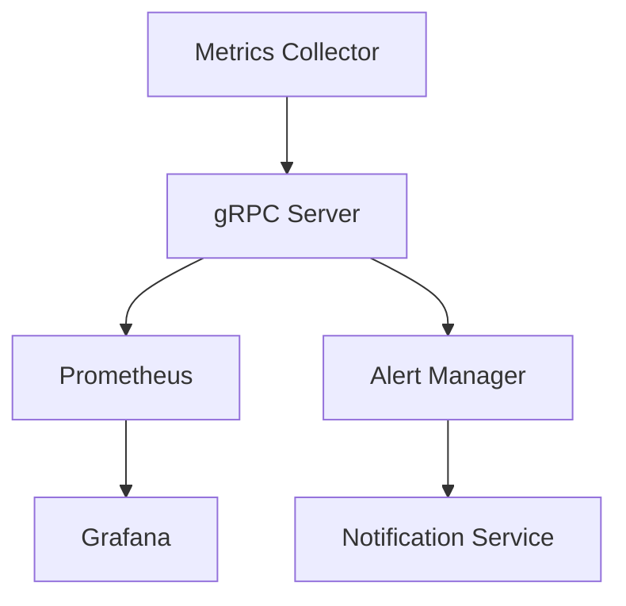

# 🐱 go-metric-watcher

Real-time System Metrics Monitoring and Alert Platform

## 📊 Key Features

### System Monitoring
- Real-time monitoring of CPU, memory, and disk usage
- Collection of API response times and performance metrics
- Tracking of error rates and system status

### Dashboard Features
- Collection and monitoring of CPU, Memory, Disk and Network metrics
- Metric storage through Prometheus
- Dashboard visualization through Grafana

### Dashboard Panels

1. CPU Monitoring
   - CPU Usage (%)
   - CPU Core Count

2. Memory Monitoring
   - Memory Usage Overview
   - Memory Usage (%)

3. Disk Monitoring
   - Disk Usage (%)
   - Disk I/O

4. Network Monitoring
   - Network Traffic (Bytes)
   - Network Packets

### Alert System
- Threshold-based alert configuration
- Slack/Email notification integration
- Alert history management

## 🛠 Tech Stack
- **Language:** Go
- **Framework:** gRPC
- **Database:** Prometheus
- **Visualization:** Grafana
- **Monitoring:** Custom Metrics Collector
- **Infrastructure:** Docker, Docker Compose

## 📐 Architecture



## 📁 Project Structure

```
.
├── README.md
├── cmd
│   ├── api
│   │	└── main.go
│   └── collector
│	└── main.go
├── deployments
│   ├── Dockerfile
│   ├── docker-compose.yml
│   ├── grafana
│   │	└── provisioning
│   │	    ├── dashboards
│   │	    │	├── alert-history.json
│   │	    │	├── dashboards.yaml
│   │	    │	└── system-metrics.json
│   │	    └── datasources
│   │		├── prometheus.yaml
│   │		└── timescaledb.yaml
│   ├── init-scripts
│   │	└── 01-init.sql
│   └── prometheus
│	└── prometheus.yml
├── domain
│   ├── domain.go
│   └── mocks
│	└── mock_domain.go
├── go.mod
├── go.sum
├── internal
│   ├── model
│   │	├── alert_rule.go
│   │	├── notification.go
│   │	└── system_metric.go
│   ├── repository
│   │	├── alert.go
│   │	└── database.go
│   └── service
│	├── metric_processor.go
│	├── processor_benchmark_test.go
│	└── processor_test.go
├── makefile
└── pkg
    ├── database
    │	└── database.go
    ├── grpcutil
    │	└── server.go
    ├── logger
    │	└── logger.go
    ├── monitoring
    │	├── cpu.go
    │	├── disk.go
    │	├── memory.go
    │	├── monitoring_test.go
    │	└── network.go
    └── notifier
	├── gmail.go
	├── notifier.go
	├── notifier_test.go
	└── slack.go

23 directories, 37 files
```

## 📌 API Documentation
### Metrics API
- `CollectMetrics`: Collect system metrics
- `StreamMetrics`: Real-time metrics streaming
- `GetMetricHistory`: Query historical metric data

### Alert API
- `ConfigureAlert`: Configure alert rules

## 🔧 Configuration


### Prometheus Configuration
```yaml
# prometheus/prometheus.yml
scrape_configs:
  - job_name: 'go-metric-watcher'
    static_configs:
      - targets: ['metrics-collector:2112']
```

### Alert Configuration
```yaml
alerts:
  cpu_usage:
    threshold: 80
    duration: 5m
    severity: warning
```

## 🚀 Getting Started

### Prerequisites

```bash
- Go 1.23 or higher
- Docker
- Docker Compose
```

### Installation

```bash
# Clone repository
git clone https://github.com/violetaplum/go-metric-watcher

# Install dependencies
go mod download

# Build
go build -o cmd/api/main.go
go build -o cmd/collector/main.go
```

### Running the Application

```bash
# Set up infrastructure
make build

# Direct execution
go build -o api cmd/api/main.go
go build -o collector cmd/collector/main.go

./api
./collector

# Run tests
go test ./...
```

## 🌐 Accessing the Dashboard

### Access Information
- Grafana: http://localhost:3000
- Prometheus: http://localhost:9090

### Login Credentials
- Username: admin
- Password: admin

### Available Services
1. Grafana Dashboard
    - System metrics visualization
    - Custom dashboard templates
    - Read-time monitoring
2. Prometheus
    - Metrics database
    - Query interface
    - Data exploration

### Simple metric api call
```bash
curl http://localhost:8080/api/v1/health
curl http://localhost:8080/api/v1/metrics
```


