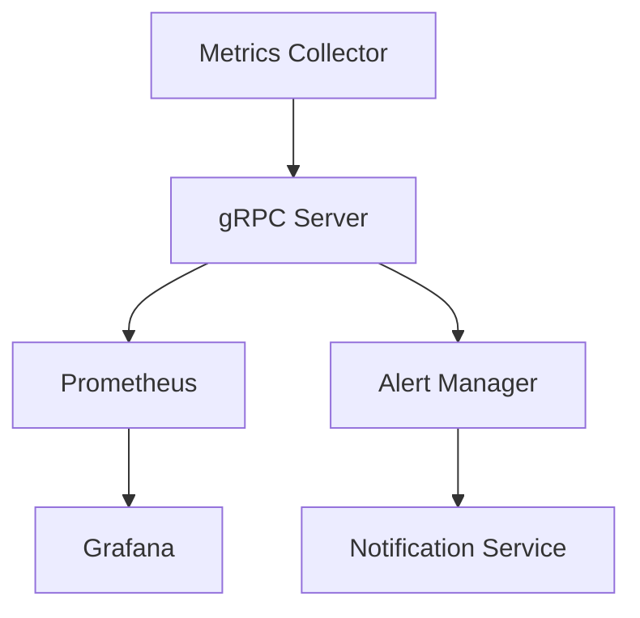

# 🐱 go-metric-watcher

실시간 시스템 메트릭 모니터링 및 알림 플랫폼

## 📊 주요 기능

### 시스템 모니터링
- CPU, 메모리, 디스크 사용량 실시간 모니터링
- API 응답시간 및 성능 지표 수집
- 에러율 및 시스템 상태 추적

### 대시보드
- Grafana 기반 실시간 메트릭 시각화
- 커스텀 대시보드 구성
- 히스토리 데이터 분석

### 알림 시스템
- 임계값 기반 알림 설정
- Slack/Email 알림 연동
- 알림 이력 관리

## 🛠 기술 스택

- **Language:** Go
- **Framework:** gRPC
- **Database:** TimescaleDB
- **Visualization:** Grafana
- **Monitoring:** Custom Metrics Collector
- **Infrastructure:** Docker, Docker Compose

## 🚀 시작하기

### 사전 요구사항

```bash
- Go 1.23 이상
- Docker
- Docker Compose
```


### 설치

1. 레포지토리 클론

```bash
git clone https://github.com/violetaplum/go-metric-watcher
```

2. 실행
```bash
make build
```

### 테스트

```bash
go test ./...
```

## 📐 아키텍처



## 📁 프로젝트 구조

```
.
├── cmd/
│   ├── api/
│   │   └── main.go
│   └── collector/
│       └── main.go
├── deployments/
│   └── grafana/
│       ├── provisioning/
│       │   └── init-scripts/
│       │       └── 01-init.sql
│       ├── docker-compose.yml
│       └── Dockerfile
├── internal/
│   ├── model/
│   │   └── metric.go
│   ├── repository/
│   │   └── timescaledb.go
│   └── service/
│       ├── collector.go
│       └── metrics.go
├── pkg/
│   ├── grpcutil/
│   │   └── server.go
│   ├── logger/
│   │   └── logger.go
│   ├── monitoring/
│   │   ├── cpu.go
│   │   ├── disk.go
│   │   └── memory.go
│   └── notifier/
│       ├── email.go
│       └── slack.go
└── prometheus/
    └── prometheus.yml
```

## 📌 API 문서
### Metrics API
- `CollectMetrics`: 시스템 메트릭 수집
- `StreamMetrics`: 실시간 메트릭 스트리밍
- `GetMetricHistory`: 과거 메트릭 데이터 조회

### Alert API
- `ConfigureAlert`: 알림 규칙 설정

## 🔧 설정


### 알림 설정
```yaml
alerts:
  cpu_usage:
    threshold: 80
    duration: 5m
    severity: warning
```
