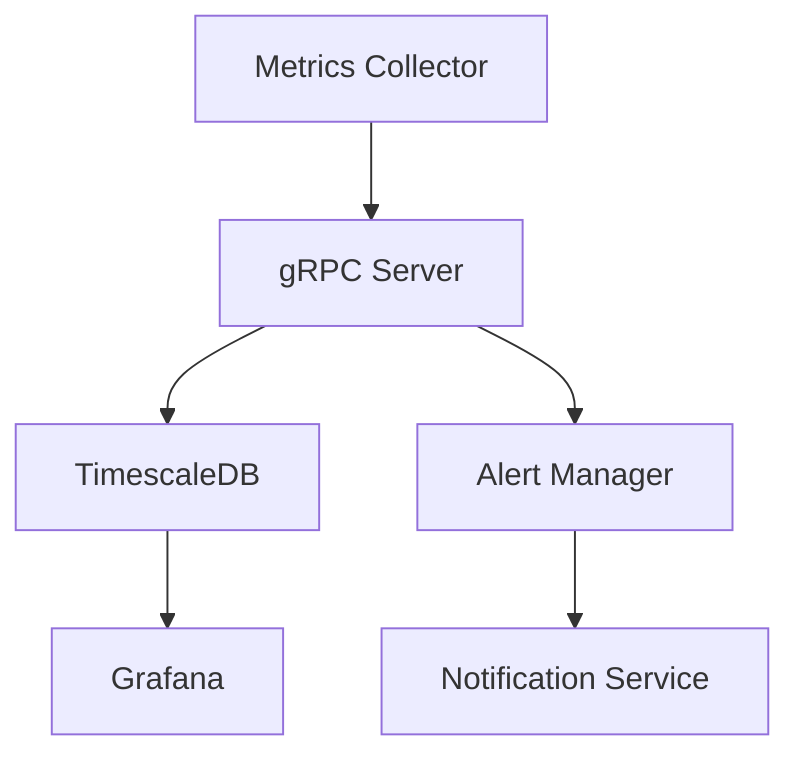

# 🐱 go-metric-watcher

실시간 시스템 메트릭 모니터링 및 알림 플랫폼

## 📊 주요 기능

### 시스템 모니터링
- CPU, 메모리, 디스크 사용량 실시간 모니터링
- API 응답시간 및 성능 지표 수집
- 에러율 및 시스템 상태 추적

### 대시보드
- Grafana 기반 실시간 메트릭 시각화
- 커스텀 대시보드 구성
- 히스토리 데이터 분석

### 알림 시스템
- 임계값 기반 알림 설정
- Slack/Email 알림 연동
- 알림 이력 관리

## 🛠 기술 스택

- **Language:** Go
- **Framework:** gRPC
- **Database:** TimescaleDB
- **Visualization:** Grafana
- **Monitoring:** Custom Metrics Collector
- **Infrastructure:** Docker, Docker Compose

## 🚀 시작하기

### 사전 요구사항

```bash
- Go 1.21 이상
- Docker
- Docker Compose
```


### 설치

1. 레포지토리 클론
```bash
git clone https://github.com/yourusername/metricat.git
cd metricat
```

2. 환경 설정
```bash
cp .env.example .env
# .env 파일 수정
```

3. 실행
```bash
docker-compose up -d
```

### 테스트

```bash
go test ./...
```

## 📐 아키텍처



## 📁 프로젝트 구조

```
.
├── cmd/
│   ├── collector/
│   │   └── main.go
│   └── api/
│       └── main.go
├── internal/
│   ├── service/
│   ├── repository/
│   └── model/
├── pkg/
│   ├── logger/
│   ├── monitoring/
│   └── notifier/
└── docker-compose.yml
```

## 📌 API 문서

### Metrics API
- `CollectMetrics`: 시스템 메트릭 수집
- `StreamMetrics`: 실시간 메트릭 스트리밍
- `GetMetricHistory`: 과거 메트릭 데이터 조회

### Alert API
- `ConfigureAlert`: 알림 규칙 설정
- `GetAlertHistory`: 알림 이력 조회

## 🔧 설정

### 환경변수
```bash
COLLECT_INTERVAL=10s     # 메트릭 수집 주기
SERVER_ID=server1       # 서버 식별자
DB_CONNECTION=...       # DB 연결 정보
```

### 알림 설정
```yaml
alerts:
  cpu_usage:
    threshold: 80
    duration: 5m
    severity: warning
```
